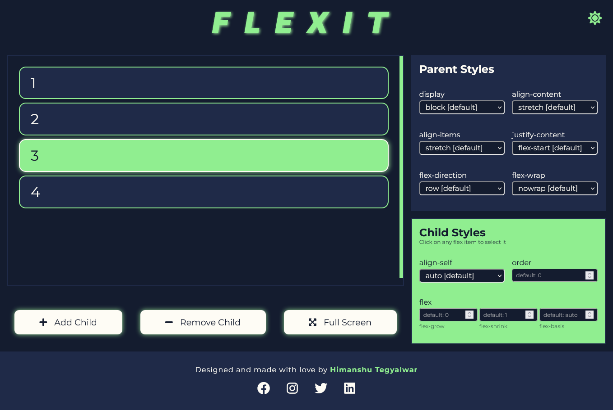
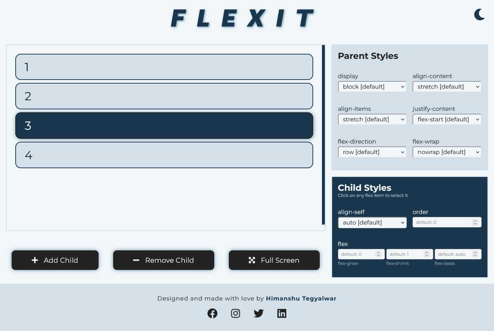

# FLEXIT


A CSS flexbox playground that visualizes the workflow of CSS flexbox

## Table of contents
- [Why Flexit?](#why-flexit)
- [UI](#ui)
- [Technologies Used](#technologies-used)
- [Usage](#usage)
- [What I learned?](#what-i-learned)
- [Coming Soon](#coming-soon)

## Why Flexit?
Flexit is built with an intension to help the beginners and some learners who face difficulty to understand the concept of flexbox. Flexit visualizes the working of flexbox and its behaviour when a certain property is applied or updated.

## UI
|            Dark Mode                |              Light Mode               |
|:-----------------------------------:|:-------------------------------------:|
|   |   |

## Technologies used


## Usage
1. **Theme:** The icon on top-left side of browser changes the theme of playground is switched to light from dark and vice-verse. The browser renders the app in dark mode if you prefer dark mode or it renders in light mode. But you always have the ability to switch it as per your convinience.

2. **Select:** To select a certain flex-item, just click on it.

3. **Add Child:** On clicking the *Add Child* button, a new child item is added to flex container.

4. **Remove Child:** The selected item is removed from DOM when *Remove Child* button is clicked and a random flex-item is selected from the existing flex-items.

5. **Full Screen/Normal Screen:** Click on *Full Screen* button to open app in full screen mode and click *Normal Screen* to exit full screen mode.

6. **Parent Styles:** Update/change parent properties according to your choice and the choosen property is applied to flex container and it changes accordingly.

6. **Child Styles:** Update/change child properties according to your choice and the choosen property is applied to selected flex-tem.

## What I learned
While working on this project I got to learn a lot new things.
1. Using Custom Scrollbars
2. Switching Theme
3. Opening window in fullscreen mode.
4. Behaviour of ```this``` in regular functions and arrow functions.

## Coming Soon
- [ ] Code Generation
- [ ] Tooltips for all properties
- [ ] Undo/Redo actions
- [ ] Render tips and tricks about Flexbox while loading
- [ ] Render theme according to time